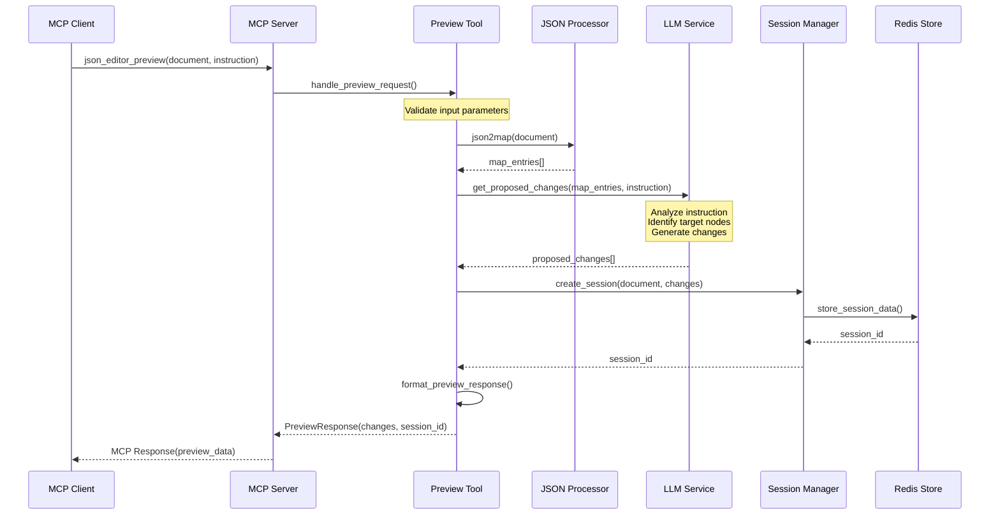
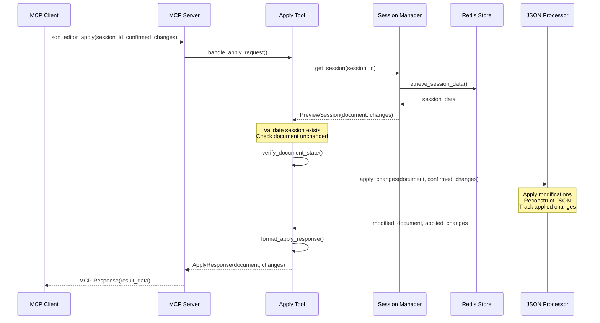
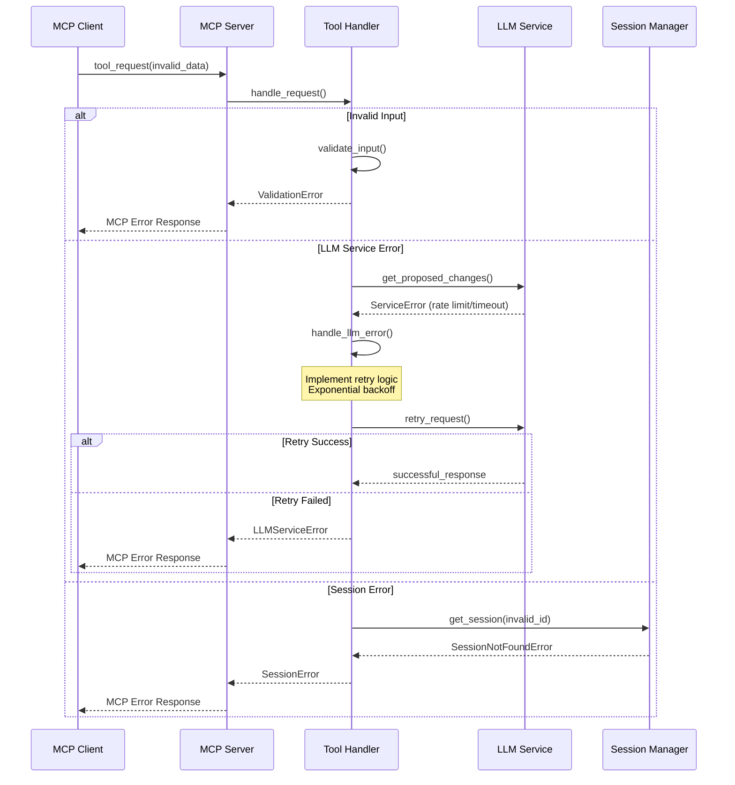
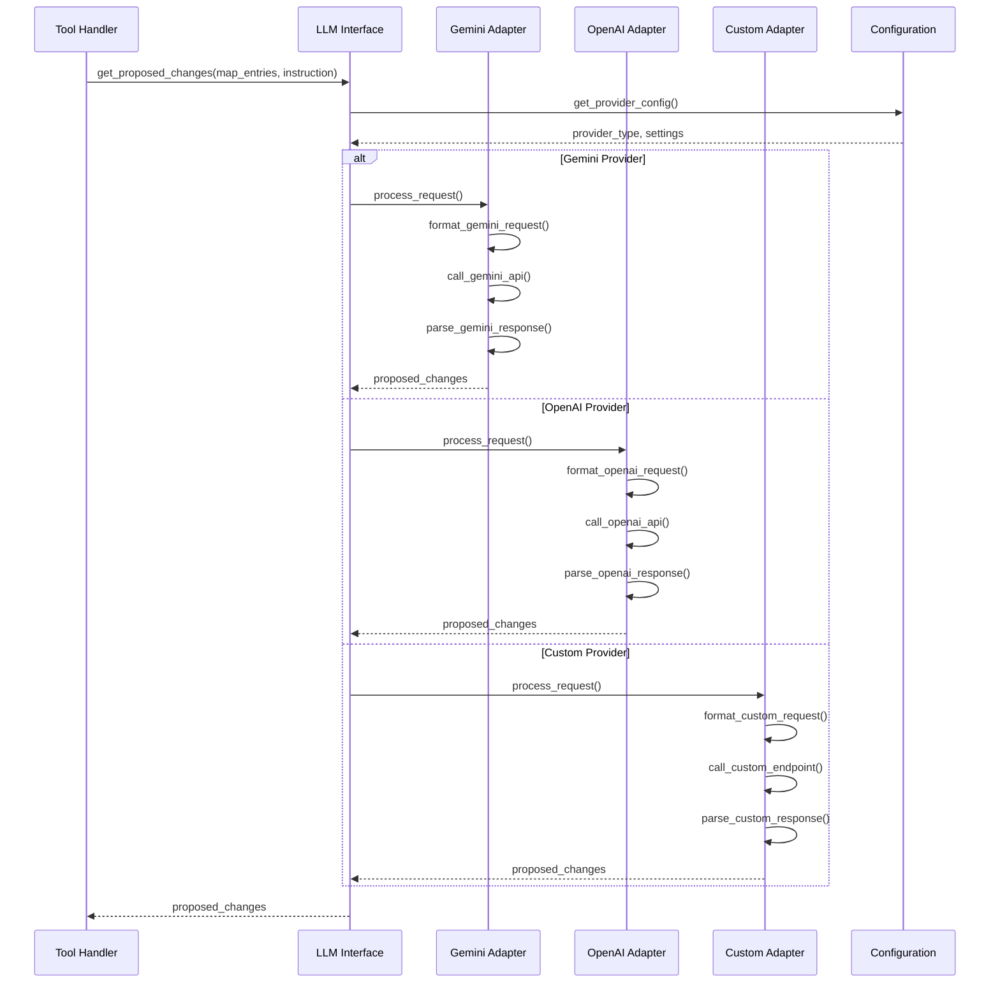
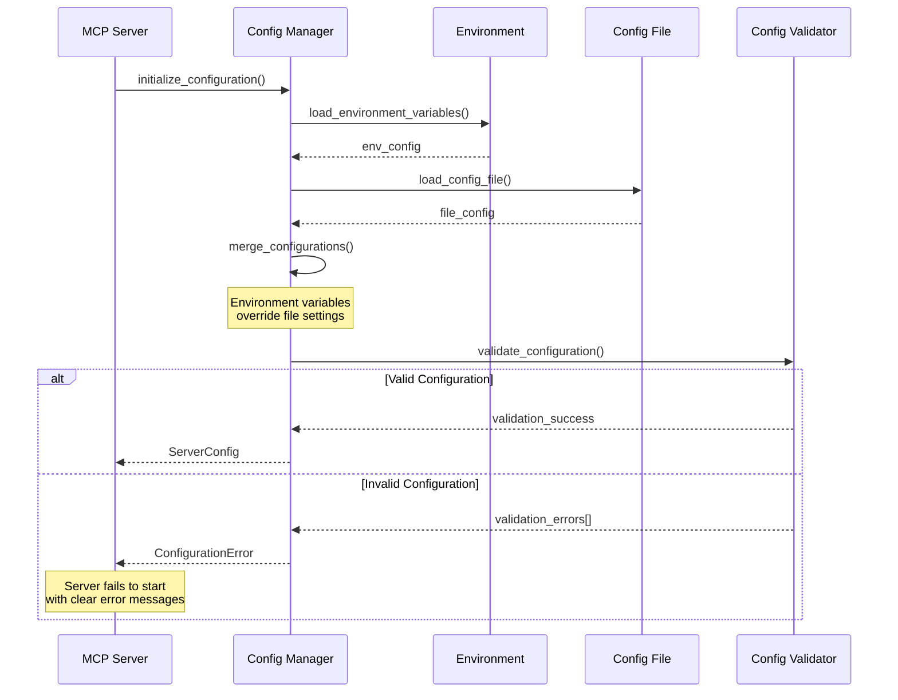
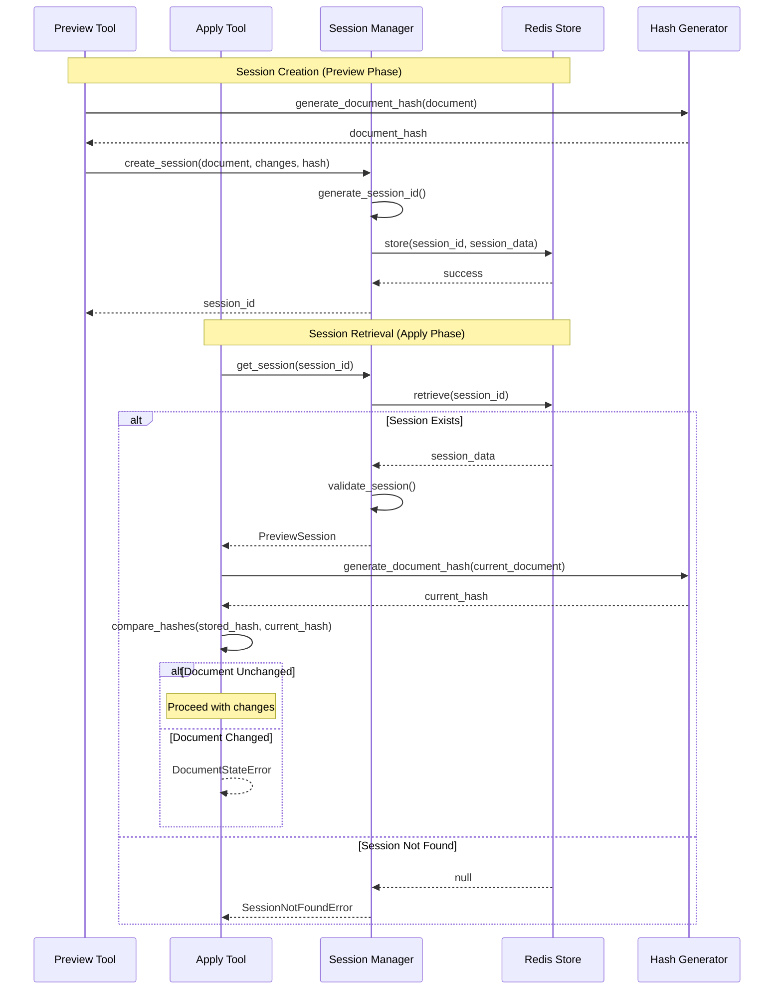
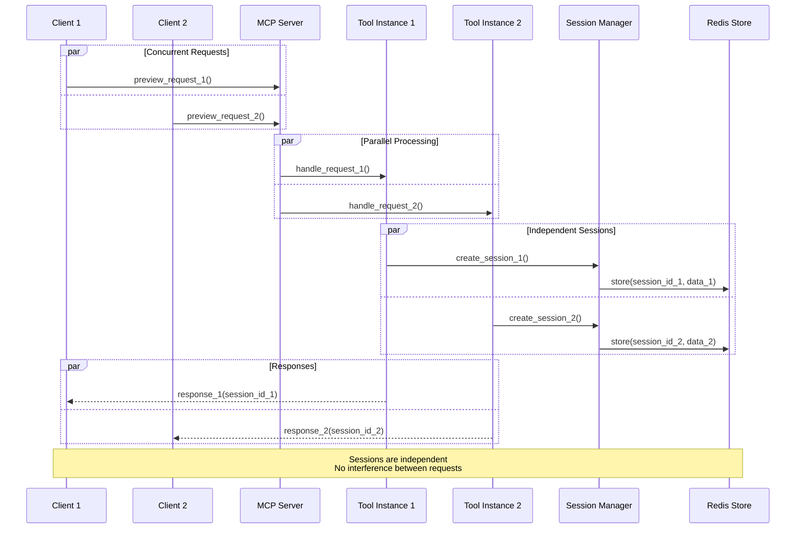

# Component Interaction Sequence Diagrams

## Preview Operation Sequence

## Apply Operation Sequence

## Error Handling Sequence

## LLM Provider Adapter Sequence

## Configuration Loading Sequence

## Session Management Sequence

## Concurrent Request Handling

